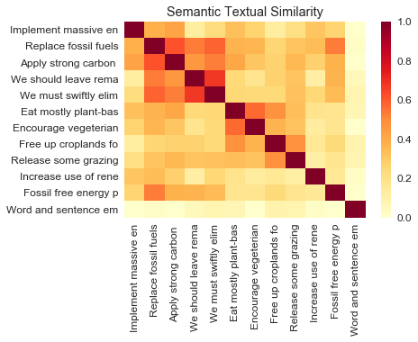

# data_analysis
Work done for the Yale Open Climate Collabathon

Why is this useful? 

Given the goal of understanding the likelihood of an actor to deliver on the commitments, this is used as a proxy of how they’re approaching their efforts

## Semantic similarity 

We explore what we can get from the semantics of the texts submitted by actors

For demonstrative purpose we look at semantic similarity between several commitments put forward in the action plans of the Covenant of Mayors (CoM) members, and some of the actions identified as most urgent and effective in the World Scientists’ Warning of a Climate Emergency (Ripple et al., 2019). To achieve this we make use of Google’s pre-trained Universal Sentence Encoder model (Cer et al., 2018), which encodes text in high dimensional vectors. A possible set of sentences made up of calls for urgent actions (1-10 below), extracts from a CoM commitment (11) and a control sentence (12) could look like:

['Implement massive energy efficiency practices',
 'Replace fossil fuels with low-carbon renewables',
 'Apply strong carbon taxes to cut fossil fuel use',
 'We should leave remaining stocks of fossil fuels in the ground ',
 'We must swiftly eliminate subsidies for fossil fuels',
 'Eat mostly plant-based foods while reducing the global consumption of animal products',
 'Encourage vegeterian and vegan diets',
 'Free up croplands for growing human plant food instead of livestock feed',
 'Release some grazing land to support natural climate solution',
 'Increase use of renewable energy sources for housing and public amenities',
 'Fossil free energy production',
 'Word and sentence embeddings have become an essential part of any Deep-Learning-based natural language processing systems.']

Comparing the embeddings generated with the Universal Sentence Encoder yields the results below for semantic similarity:

Using the model on our example sentences, we see that it correctly groups the energy-related statements and diet-related statements. We also notice that there is no clear separation into different groups, which makes sense given that these issues are interrelated and likely show up in similar contexts in the datasets that the model has been trained on. The example extracted from the CoM dataset "fossil free energy production" is found to be similar to the energy-related statements, the highest overlap being with "Replace fossil fuels with low-carbon renewables". Finally, the control sentence is correctly found to be unrelated to the rest.

Since USE generated embeddings for sentences rather than words, it is more successful at recognising the similarity between statements that show up in similar contexts even if they do not shae the same vocabulary. 

Already the simple semantic similarity comparison with USE can give us some measure of how well the actors are aligned with the actions we are interested in, but it is also possible to tweak the pre-trained model further to increase precision for a specific task. 

## Urgency classifier

To assess the urgency with which the actors report their commitents and progress we started building a classifier that can be used to detect urgency in any climate-change related texts. We define a text as urgent if the language used:

* intentionally uses phrases that are meant to convey urgency (e.g. climate crisis, breakdown, emergency)
* stresses how devastating the effects of climate change are and will be
* points out there is little time left to act/no time to waste
* calls for radical change/action 

Our goal is to make use of pre-trained deep learning models and weak supervision to overcome the issue of a lack of large labeled datasets relevant for climate action tracking. We draw on the approach presented [here](https://medium.com/sculpt/a-technique-for-building-nlp-classifiers-efficiently-with-transfer-learning-and-weak-supervision-a8e2f21ca9c8 to build a powerful classifier for the task. Specifically, we intend to make use of Google's [Snorkel](https://arxiv.org/abs/1711.10160) to generate a large training dataset for the classifier by relying on labeling functions to probabilistically label large unlabeled datasets. 

Part completed for the hackathon: 

1. Created a dataset of 20000 Guardian articles about climate change accessed through the Guardian API
2. Started reviewing and labeling a randomly chosen sample of 700 data points as 'urgent', 'not urgent' or 'neutral'

To be completed: 

1. Building the training set with Snorkel 
2. Building the Classification model 

